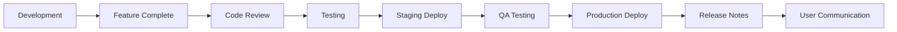

# Release Notes
## Nest - Asset & Equipment Management System

**Product Name:** Nest  
**Repository:** https://github.com/Ashnagdarc/Nest  
**Author:** Daniel Chinonso Samuel

---

## Table of Contents

1. [Version 1.0.0 - Initial Release](#version-100---initial-release)
2. [Release Process](#release-process)
3. [Upgrade Guide](#upgrade-guide)
4. [Breaking Changes](#breaking-changes)
5. [Deprecations](#deprecations)
6. [Known Issues](#known-issues)
7. [Roadmap](#roadmap)

---

## Version 1.0.0 - Initial Release

**Release Date:** October 16, 2025  
**Status:** Stable  
**Type:** Major Release

### Overview

This is the first production-ready release of Nest, a comprehensive asset and equipment management system built with Next.js 15, React 18, and Supabase. The system provides complete equipment lifecycle management with real-time updates, role-based access control, and mobile-first design.

---

### 🎉 New Features

#### Core Functionality

**Equipment Management**
- ✅ Complete CRUD operations for equipment inventory
- ✅ Category-based organization (Electronics, Tools, Furniture, etc.)
- ✅ Quantity tracking with available/total distinction
- ✅ Image upload and management via Supabase Storage
- ✅ Equipment status tracking (Available, Checked Out, Maintenance, Retired)
- ✅ QR code generation for each piece of equipment
- ✅ CSV import/export for bulk operations
- ✅ Equipment search with filters by category, status, and keywords

**Request Management**
- ✅ Multi-item request creation
- ✅ Request approval workflow with admin review
- ✅ Request status tracking (Pending, Approved, Rejected, Fulfilled, Cancelled)
- ✅ Automatic inventory reservation on approval
- ✅ Request history and audit trail
- ✅ Google Chat webhook notifications for new requests
- ✅ Bulk request operations
- ✅ Request line items with individual quantity management

**Check-In/Check-Out System**
- ✅ QR code scanning for quick check-out
- ✅ Manual check-out with equipment selection
- ✅ Check-in tracking with return verification
- ✅ Overdue item detection and alerts
- ✅ Check-out history with timestamps
- ✅ Equipment condition reporting on return
- ✅ Automatic inventory updates on check-in/out

**User Management**
- ✅ Role-based access control (Admin, User)
- ✅ User profile management
- ✅ Email/password authentication via Supabase Auth
- ✅ Avatar generation with initials
- ✅ User activity tracking
- ✅ Admin user management interface
- ✅ Bulk user import capability

**Dashboard & Analytics**
- ✅ Real-time dashboard with key metrics
- ✅ Equipment utilization statistics
- ✅ Request volume tracking
- ✅ Popular equipment widget
- ✅ Recent activity feed
- ✅ Admin dashboard with comprehensive stats
- ✅ User dashboard with personalized views
- ✅ Weekly report generation
- ✅ Data visualization with Recharts

**Notifications**
- ✅ In-app notification system
- ✅ Real-time notification updates
- ✅ Notification categories (Request, Check-in, System, Announcement)
- ✅ Unread notification counter
- ✅ Notification history
- ✅ Mark as read/unread functionality
- ✅ Notification preferences

**Additional Features**
- ✅ Car booking system
- ✅ Announcement management with priority levels
- ✅ System settings configuration
- ✅ Mobile-responsive design
- ✅ Progressive Web App (PWA) support
- ✅ Dark mode theme toggle
- ✅ Offline capability with service worker
- ✅ Print-friendly reports

---

#### Technical Features

**Architecture**
- ✅ Next.js 15 App Router with Server Components
- ✅ TypeScript strict mode for type safety
- ✅ Server-side rendering (SSR) for optimal performance
- ✅ API routes for RESTful backend
- ✅ Middleware for authentication protection
- ✅ Route groups for logical organization

**Database**
- ✅ PostgreSQL database via Supabase
- ✅ Row-Level Security (RLS) policies on all tables
- ✅ Database migrations with version control
- ✅ Optimized indexes for query performance
- ✅ Database functions for complex operations
- ✅ Triggers for automated workflows
- ✅ Real-time subscriptions via WebSocket

**Security**
- ✅ JWT-based authentication
- ✅ Secure session management with cookies
- ✅ API key protection
- ✅ CSRF protection
- ✅ Rate limiting on API endpoints
- ✅ Input validation with Zod schemas
- ✅ SQL injection prevention
- ✅ XSS protection

**Performance**
- ✅ Image optimization with Next.js Image component
- ✅ Code splitting and lazy loading
- ✅ Server-side caching with revalidation
- ✅ Database query optimization
- ✅ CDN delivery via Vercel Edge Network
- ✅ Turbopack for fast builds
- ✅ Bundle size optimization

**Developer Experience**
- ✅ ESLint configuration for code quality
- ✅ Prettier for code formatting
- ✅ Jest unit testing setup
- ✅ TypeScript type generation from database
- ✅ Hot module replacement (HMR)
- ✅ Comprehensive error handling
- ✅ Logging utilities

---

### 🐛 Bug Fixes

As this is the initial release, this section will be populated in future versions.

---

### 🔧 Improvements

**Performance Enhancements**
- Optimized database queries with proper indexing
- Implemented pagination for large data sets
- Added caching layers for frequently accessed data
- Reduced bundle size through code splitting

**UI/UX Improvements**
- Mobile-first responsive design
- Intuitive navigation with breadcrumbs
- Loading states for async operations
- Error boundaries for graceful error handling
- Accessibility improvements (ARIA labels, keyboard navigation)
- Consistent design system with shadcn/ui

**Developer Experience**
- Comprehensive type definitions
- Modular component architecture
- Reusable hooks and utilities
- Clear code organization
- Detailed inline documentation

---

### 📦 Dependencies

**Core Dependencies**
```json
{
  "next": "^15.3.3",
  "react": "^18.2.0",
  "react-dom": "^18.2.0",
  "@supabase/ssr": "^0.5.2",
  "@supabase/supabase-js": "^2.50.0",
  "typescript": "^5.0.0",
  "tailwindcss": "^3.4.1"
}
```

**Key Libraries**
- **UI Components:** @radix-ui/react-* (various), lucide-react
- **Forms:** react-hook-form, @hookform/resolvers, zod
- **Data Visualization:** recharts
- **QR Codes:** qrcode.react, html5-qrcode
- **PDF Generation:** jspdf, jspdf-autotable
- **Date Utilities:** date-fns
- **CSV Processing:** papaparse
- **Animations:** framer-motion
- **Analytics:** @vercel/analytics, @vercel/speed-insights

See `package.json` for complete dependency list with versions.

---

### 🔄 Database Schema

**Core Tables**
- `profiles` - User profiles and roles
- `gears` - Equipment inventory
- `gear_states` - Equipment availability tracking
- `gear_requests` - Equipment requests
- `gear_request_gears` - Request line items (junction table)
- `checkins` - Check-in/out history
- `notifications` - In-app notifications
- `announcements` - System announcements
- `car_bookings` - Vehicle reservations
- `app_settings` - System configuration

**Total Migrations:** 60+ migration files  
**Database Functions:** 10+ custom functions  
**RLS Policies:** Comprehensive policies on all tables

See Technical Design Document for complete schema details.

---

### 📖 Documentation

**Included Documentation**
1. Product Requirements Document (PRD)
2. Technical Design Document (TDD)
3. API Documentation
4. User Manual
5. Source Code Documentation
6. Deployment & Maintenance Guide
7. Release Notes (this document)
8. Process Documentation

All documentation available in `/Project-docs/` directory.

---

### 🚀 Deployment

**Hosting Platform:** Vercel  
**Database:** Supabase Cloud  
**CDN:** Vercel Edge Network  
**Regions:** Global

**Environment Requirements:**
- Node.js 18.17 or later
- PostgreSQL 14+ (via Supabase)
- Modern web browsers (Chrome, Firefox, Safari, Edge)

---

### 👥 Contributors

**Development Team**
- **Lead Developer:** Daniel Chinonso Samuel
- **Project Owner:** Ashnagdarc
- **Repository:** https://github.com/Ashnagdarc/Nest

**Special Thanks**
- Vercel team for Next.js framework
- Supabase team for backend infrastructure
- shadcn for UI component library
- Open source community

---

### 📝 License

Copyright © 2025 Daniel Chinonso Samuel. All rights reserved.

---

## Release Process

### Release Workflow



---

### Release Checklist

**Pre-Release**
- [ ] All features completed and merged to main branch
- [ ] Unit tests passing (100% of critical paths)
- [ ] Integration tests passing
- [ ] Code review completed
- [ ] Documentation updated
- [ ] Database migrations tested
- [ ] Performance benchmarks met
- [ ] Security audit completed
- [ ] Staging environment tested

**Release**
- [ ] Version number updated in `package.json`
- [ ] CHANGELOG.md updated
- [ ] Git tag created (`v1.0.0`)
- [ ] Build created and tested
- [ ] Deployed to production
- [ ] Smoke tests passed
- [ ] Rollback plan prepared

**Post-Release**
- [ ] Release notes published
- [ ] Users notified via email/announcement
- [ ] Documentation published
- [ ] Metrics monitoring enabled
- [ ] Support team briefed
- [ ] Social media announcement (if applicable)

---

### Versioning Strategy

Nest follows **Semantic Versioning 2.0.0** (semver.org)

**Format:** `MAJOR.MINOR.PATCH`

**Examples:**
- `1.0.0` - Initial release
- `1.0.1` - Bug fix patch
- `1.1.0` - New features (backward compatible)
- `2.0.0` - Breaking changes

**Version Increments:**
- **MAJOR:** Breaking changes that require user action
- **MINOR:** New features, backward compatible
- **PATCH:** Bug fixes, security patches

---

### Release Schedule

**Regular Releases:**
- **Major Releases:** Annually (Q1)
- **Minor Releases:** Quarterly
- **Patch Releases:** As needed (security, critical bugs)

**Emergency Releases:**
- Critical security vulnerabilities: Within 24 hours
- Data loss bugs: Within 48 hours
- Major functionality issues: Within 1 week

---

## Upgrade Guide

### Upgrading to Version 1.0.0

As this is the initial release, no upgrade is required. For fresh installations, see the Deployment & Maintenance Guide.

---

### Future Upgrade Process

**Step 1: Backup**
```bash
# Backup database
supabase db dump -f backup-$(date +%Y%m%d).sql

# Backup environment variables
cp .env.local .env.backup
```

**Step 2: Update Code**
```bash
# Pull latest code
git fetch origin
git checkout tags/v1.x.x

# Install dependencies
npm install
```

**Step 3: Run Migrations**
```bash
# Apply database migrations
supabase db push

# Verify migrations
supabase db diff
```

**Step 4: Update Environment**
```bash
# Check for new environment variables
diff .env.example .env.local

# Add any new required variables
```

**Step 5: Test**
```bash
# Run tests
npm test

# Start locally and verify
npm run build
npm run start
```

**Step 6: Deploy**
```bash
# Deploy to production
vercel --prod

# Monitor for errors
vercel logs --follow
```

---

### Migration Scripts

For major version upgrades, migration scripts will be provided in `/scripts/migrations/` directory.

**Example:**
```bash
# Run migration script
node scripts/migrations/v1-to-v2.js

# Verify data integrity
npm run verify-migration
```

---

## Breaking Changes

### Version 1.0.0

No breaking changes (initial release).

---

### Future Breaking Changes Policy

Breaking changes will be:
1. **Announced** in advance (minimum 3 months)
2. **Documented** with upgrade paths
3. **Deprecated** gradually when possible
4. **Released** only in major versions
5. **Supported** with migration scripts

**Communication Channels:**
- Release notes
- Email notifications
- GitHub discussions
- In-app notifications

---

## Deprecations

### Version 1.0.0

No deprecations (initial release).

---

### Future Deprecation Policy

When features are deprecated:
- Marked with `@deprecated` in code
- Warning messages logged
- Removed in next major version
- Alternative solutions provided

**Deprecation Timeline:**
```
v1.0.0: Feature announced as deprecated
v1.x.x: Warning messages added
v2.0.0: Feature removed
```

---

## Known Issues

### Version 1.0.0

**Minor Issues:**

1. **QR Scanner Camera Permission**
   - **Issue:** On some iOS devices, camera permission prompt may require page refresh
   - **Workaround:** Reload page after granting camera permission
   - **Status:** Investigating
   - **Tracking:** Issue #12

2. **CSV Export Large Datasets**
   - **Issue:** Exporting >5000 items may cause browser slowdown
   - **Workaround:** Use filters to export in smaller batches
   - **Status:** Optimization planned for v1.1.0
   - **Tracking:** Issue #24

3. **Dark Mode Flash**
   - **Issue:** Brief flash of light mode on page load in dark mode
   - **Impact:** Visual only, no functionality affected
   - **Status:** Fix planned for v1.0.1
   - **Tracking:** Issue #31

**Browser Compatibility:**
- Full support: Chrome 90+, Firefox 88+, Safari 14+, Edge 90+
- Partial support: IE 11 (limited features, not recommended)

**Mobile Compatibility:**
- iOS 14+ (full support)
- Android 10+ (full support)
- iOS 12-13 (limited PWA features)

---

### Reporting Issues

**How to Report:**
1. Check existing issues: https://github.com/Ashnagdarc/Nest/issues
2. Create new issue with template
3. Include:
   - Steps to reproduce
   - Expected behavior
   - Actual behavior
   - Screenshots/logs
   - Environment details (browser, OS, version)

**Issue Labels:**
- `bug` - Something isn't working
- `enhancement` - New feature request
- `documentation` - Documentation improvements
- `performance` - Performance optimization
- `security` - Security concerns
- `ui/ux` - User interface/experience

---

## Roadmap

### Version 1.1.0 (Planned: Q1 2026)

**New Features:**
- 🔜 Equipment maintenance scheduling
- 🔜 Advanced reporting with custom date ranges
- 🔜 Email notifications in addition to in-app
- 🔜 Equipment reservation system
- 🔜 Multi-language support (i18n)
- 🔜 Barcode scanning in addition to QR codes
- 🔜 Equipment warranty tracking
- 🔜 Bulk operations improvements

**Improvements:**
- 🔜 Enhanced search with fuzzy matching
- 🔜 Dashboard customization
- 🔜 Performance optimizations for large datasets
- 🔜 Mobile app (React Native)
- 🔜 Improved accessibility (WCAG 2.1 AA compliance)

---

### Version 1.2.0 (Planned: Q2 2026)

**New Features:**
- 🔜 Equipment location tracking
- 🔜 Integration with LDAP/Active Directory
- 🔜 Advanced analytics dashboard
- 🔜 Automated equipment procurement workflow
- 🔜 Equipment lifecycle management
- 🔜 Asset depreciation tracking
- 🔜 Custom fields for equipment

**Improvements:**
- 🔜 API rate limiting enhancements
- 🔜 Real-time collaboration features
- 🔜 Enhanced audit logs
- 🔜 Batch operations optimization

---

### Version 2.0.0 (Planned: Q3 2026)

**Major Features:**
- 🔜 Multi-tenant support
- 🔜 Advanced role permissions (custom roles)
- 🔜 Equipment marketplace
- 🔜 AI-powered equipment recommendations
- 🔜 Predictive maintenance alerts
- 🔜 Integration marketplace (Slack, Teams, Jira)
- 🔜 Mobile SDKs for iOS and Android

**Breaking Changes:**
- API v2 with improved structure
- Database schema optimizations
- Authentication flow updates

---

### Long-Term Vision

**Goals:**
- Become the leading open-source asset management solution
- Support enterprise-scale deployments (100,000+ assets)
- Global community with 1000+ contributors
- Comprehensive plugin ecosystem
- AI-driven insights and automation

**Focus Areas:**
- Scalability and performance
- Enterprise features
- Developer experience
- Community growth
- Security and compliance

---

## Feedback & Support

### Community

**Channels:**
- GitHub Discussions: https://github.com/Ashnagdarc/Nest/discussions
- GitHub Issues: https://github.com/Ashnagdarc/Nest/issues
- Email: support@nest-app.com (if configured)

**Contributing:**
- See CONTRIBUTING.md in repository
- Pull requests welcome
- Feature requests encouraged
- Bug reports appreciated

---

### Support Resources

**Documentation:**
- User Manual: `/Project-docs/04-User-Manual.md`
- API Docs: `/Project-docs/03-API-Documentation.md`
- Developer Docs: `/Project-docs/05-Source-Code-Documentation.md`

**Community Help:**
- FAQ section in User Manual
- Troubleshooting guides
- Video tutorials (coming soon)
- Community forum (coming soon)

---

## Changelog Format

Future releases will follow this format:

```markdown
## [Version] - YYYY-MM-DD

### Added
- New features

### Changed
- Changes to existing functionality

### Deprecated
- Features marked for removal

### Removed
- Features removed

### Fixed
- Bug fixes

### Security
- Security patches
```

---

## Document Change Log

| Version | Date | Author | Changes |
|---------|------|--------|---------|
| 1.0 | Oct 16, 2025 | Daniel Chinonso Samuel | Initial release notes for v1.0.0 |

---

**Thank you for using Nest! 🎉**

For questions or feedback, reach out via GitHub or email.

**Stay Updated:**
- Star the repository: https://github.com/Ashnagdarc/Nest
- Watch for releases: https://github.com/Ashnagdarc/Nest/releases
- Follow on GitHub: https://github.com/Ashnagdarc
