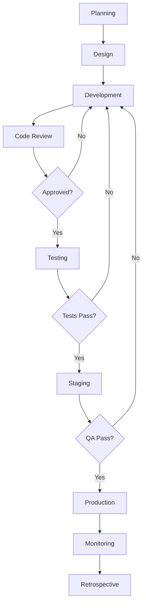
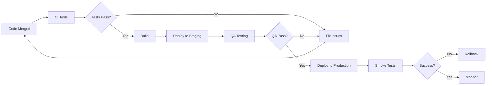
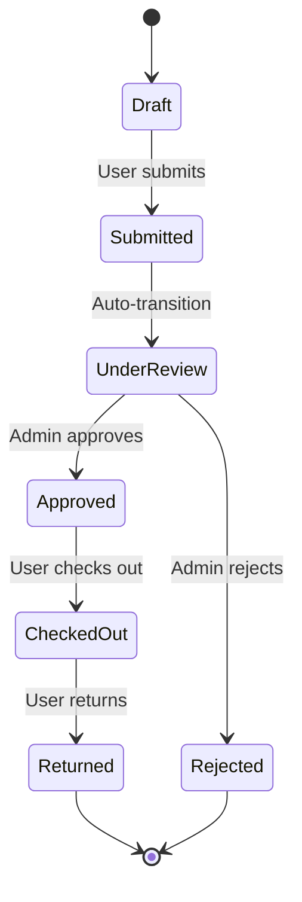

# Process Documentation
## Nest - Asset & Equipment Management System

**Document Version:** 1.0  
**Last Updated:** October 16, 2025  
**Author:** Daniel Chinonso Samuel  
**Repository:** https://github.com/Ashnagdarc/Nest

---

## Table of Contents

1. [Development Workflow](#development-workflow)
2. [Git Branching Strategy](#git-branching-strategy)
3. [Code Review Process](#code-review-process)
4. [Testing Process](#testing-process)
5. [Deployment Process](#deployment-process)
6. [Change Management](#change-management)
7. [Incident Response](#incident-response)
8. [Equipment Request Workflow](#equipment-request-workflow)
9. [User Onboarding Process](#user-onboarding-process)
10. [Data Management Process](#data-management-process)

---

## Development Workflow

### Overview

Nest follows an Agile development methodology with 2-week sprints. The development workflow ensures code quality, collaboration, and continuous delivery.

---

### Development Lifecycle



---

### Sprint Cycle

**Sprint Duration:** 2 weeks

**Sprint Schedule:**

| Day | Activity | Time | Participants |
|-----|----------|------|--------------|
| Monday (Week 1) | Sprint Planning | 2 hours | Full team |
| Daily | Daily Standup | 15 min | Full team |
| Wednesday (Week 1) | Design Review | 1 hour | Designers, Tech Lead |
| Monday (Week 2) | Mid-Sprint Check | 30 min | Full team |
| Thursday (Week 2) | Sprint Review | 1 hour | Team + Stakeholders |
| Friday (Week 2) | Sprint Retrospective | 1 hour | Full team |

---

### Daily Standup Format

**Time:** 9:00 AM (15 minutes max)

**Each team member answers:**
1. What did I accomplish yesterday?
2. What will I work on today?
3. Are there any blockers?

**Standup Rules:**
- Keep it brief and focused
- Take detailed discussions offline
- Update task board during standup
- Identify blockers immediately

---

### Task Management

**Task Board Columns:**
1. **Backlog** - Prioritized list of work
2. **To Do** - Selected for current sprint
3. **In Progress** - Actively being worked on
4. **Code Review** - Awaiting peer review
5. **Testing** - In QA testing
6. **Done** - Completed and deployed

**Task Priority Levels:**
- **P0 - Critical:** System down, data loss (immediate)
- **P1 - High:** Major feature broken (within 24h)
- **P2 - Medium:** Minor issues (within sprint)
- **P3 - Low:** Nice to have (backlog)

---

### Story Estimation

**Estimation Scale (Story Points):**
- **1 point:** < 2 hours (trivial)
- **2 points:** 2-4 hours (simple)
- **3 points:** 4-8 hours (moderate)
- **5 points:** 1-2 days (complex)
- **8 points:** 2-3 days (very complex)
- **13 points:** > 3 days (needs breakdown)

**Estimation Guidelines:**
- Stories > 8 points should be broken down
- Include testing time in estimates
- Account for code review cycles
- Consider dependencies

---

## Git Branching Strategy

### Branch Structure

Nest uses **Git Flow** branching strategy:

```
main (production)
├── develop (integration)
│   ├── feature/add-equipment-search
│   ├── feature/notification-system
│   ├── bugfix/qr-scanner-ios
│   └── hotfix/security-patch
└── hotfix/critical-auth-bug (emergency)
```

---

### Branch Types

**Main Branches:**
- `main` - Production code (always deployable)
- `develop` - Integration branch for features

**Supporting Branches:**
- `feature/*` - New features
- `bugfix/*` - Bug fixes
- `hotfix/*` - Emergency production fixes
- `release/*` - Release preparation

---

### Branch Naming Convention

```
<type>/<issue-number>-<short-description>

Examples:
feature/42-equipment-qr-codes
bugfix/73-notification-bell-count
hotfix/91-auth-session-timeout
release/1.1.0
```

**Type Prefixes:**
- `feature/` - New functionality
- `bugfix/` - Bug fixes
- `hotfix/` - Production emergency fixes
- `release/` - Release preparation
- `docs/` - Documentation updates
- `refactor/` - Code refactoring
- `test/` - Test additions/updates

---

### Feature Branch Workflow

**Step 1: Create Feature Branch**
```bash
# Switch to develop
git checkout develop
git pull origin develop

# Create feature branch
git checkout -b feature/123-equipment-filters

# Push branch to remote
git push -u origin feature/123-equipment-filters
```

**Step 2: Develop Feature**
```bash
# Make changes
# ... code ...

# Commit regularly with meaningful messages
git add .
git commit -m "feat: add category filter to equipment list"

# Push commits
git push origin feature/123-equipment-filters
```

**Step 3: Keep Branch Updated**
```bash
# Regularly sync with develop
git checkout develop
git pull origin develop

git checkout feature/123-equipment-filters
git rebase develop

# Resolve conflicts if any
git push origin feature/123-equipment-filters --force-with-lease
```

**Step 4: Create Pull Request**
- Create PR from feature branch to `develop`
- Fill out PR template
- Request reviews from 2+ team members
- Link to related issue

**Step 5: Merge After Approval**
```bash
# Squash and merge via GitHub UI
# Delete feature branch after merge
git branch -d feature/123-equipment-filters
git push origin --delete feature/123-equipment-filters
```

---

### Hotfix Workflow

For critical production issues:

```bash
# Create hotfix branch from main
git checkout main
git pull origin main
git checkout -b hotfix/critical-auth-bug

# Fix the issue
# ... code ...

# Commit and push
git commit -am "fix: resolve authentication session timeout"
git push origin hotfix/critical-auth-bug

# Create PR to main
# After merge to main, also merge to develop
git checkout develop
git merge main
git push origin develop

# Tag the release
git tag -a v1.0.1 -m "Hotfix: Authentication session timeout"
git push origin v1.0.1
```

---

### Commit Message Convention

Follow **Conventional Commits** specification:

**Format:**
```
<type>(<scope>): <subject>

<body>

<footer>
```

**Types:**
- `feat:` - New feature
- `fix:` - Bug fix
- `docs:` - Documentation changes
- `style:` - Code style (formatting, no logic change)
- `refactor:` - Code refactoring
- `perf:` - Performance improvements
- `test:` - Test additions/updates
- `chore:` - Build process, dependencies

**Examples:**
```bash
feat(equipment): add QR code scanning capability

Implemented QR code scanner using html5-qrcode library.
Users can now scan equipment QR codes for quick checkout.

Closes #123

---

fix(auth): resolve session timeout issue

Session was timing out after 5 minutes due to incorrect
token refresh logic. Now properly refreshes tokens before expiry.

Fixes #456

---

docs(api): update authentication endpoints documentation

Added missing response examples and error codes for
/api/auth/login and /api/auth/signup endpoints.
```

---

## Code Review Process

### Code Review Guidelines

**Objectives:**
1. Ensure code quality and maintainability
2. Share knowledge across the team
3. Catch bugs before production
4. Enforce coding standards
5. Improve security

---

### Pull Request Requirements

**Before Creating PR:**
- [ ] Code compiles without errors
- [ ] All tests pass locally
- [ ] New tests added for new features
- [ ] Code follows style guide
- [ ] No console.log or debug code
- [ ] Documentation updated
- [ ] Self-review completed

**PR Template:**

```markdown
## Description
Brief description of changes

## Type of Change
- [ ] Bug fix
- [ ] New feature
- [ ] Breaking change
- [ ] Documentation update

## Related Issue
Closes #123

## Changes Made
- Added equipment QR code generation
- Implemented QR scanner component
- Updated database schema for QR codes

## Testing
- [ ] Unit tests pass
- [ ] Integration tests pass
- [ ] Manual testing completed

## Screenshots (if applicable)
[Add screenshots here]

## Checklist
- [ ] Code follows style guidelines
- [ ] Self-review completed
- [ ] Comments added for complex logic
- [ ] Documentation updated
- [ ] No breaking changes (or documented)
```

---

### Review Process

**Step 1: Assignment**
- PR automatically assigns 2 reviewers
- Reviewers notified via GitHub/Slack
- Target: First review within 24 hours

**Step 2: Review**
Reviewers check:
- Code quality and readability
- Logic correctness
- Test coverage
- Performance implications
- Security concerns
- Documentation completeness

**Step 3: Feedback**
- Leave inline comments
- Request changes if needed
- Approve if satisfactory
- Be constructive and respectful

**Step 4: Approval**
- Requires 2 approvals minimum
- All conversations resolved
- CI/CD checks passing

**Step 5: Merge**
- Squash and merge to develop
- Delete feature branch
- Update related issues

---

### Review Response Time

**SLA Targets:**
- First review: 24 hours
- Subsequent reviews: 12 hours
- Critical hotfixes: 2 hours

**Priority Guidelines:**
- P0 (Critical): Review immediately
- P1 (High): Review within 4 hours
- P2 (Medium): Review within 24 hours
- P3 (Low): Review within 48 hours

---

### Code Review Checklist

**Functionality:**
- [ ] Code does what it's supposed to do
- [ ] Edge cases handled
- [ ] Error handling implemented
- [ ] No obvious bugs

**Code Quality:**
- [ ] Code is readable and maintainable
- [ ] Follows DRY principle (Don't Repeat Yourself)
- [ ] Proper naming conventions
- [ ] Appropriate abstractions
- [ ] No over-engineering

**Testing:**
- [ ] Adequate test coverage (>80%)
- [ ] Tests are meaningful
- [ ] Edge cases tested
- [ ] Error cases tested

**Security:**
- [ ] No hardcoded secrets
- [ ] Input validation present
- [ ] SQL injection prevention
- [ ] XSS protection
- [ ] Authentication/authorization checked

**Performance:**
- [ ] No obvious performance issues
- [ ] Database queries optimized
- [ ] Caching used appropriately
- [ ] No unnecessary computations

**Documentation:**
- [ ] Complex logic commented
- [ ] API documented
- [ ] README updated if needed
- [ ] Type definitions provided

---

## Testing Process

### Testing Strategy

Nest follows a **Test Pyramid** approach:

```
        /\
       /E2E\          (Few, slow, expensive)
      /------\
     /  API  \        (Medium number)
    /----------\
   / UNIT TESTS \     (Many, fast, cheap)
  /--------------\
```

**Test Distribution:**
- 70% Unit Tests
- 20% Integration Tests
- 10% End-to-End Tests

---

### Test Types

**1. Unit Tests**
- Test individual functions/components
- Fast execution (< 1s per test)
- No external dependencies
- High coverage (>80%)

**Example: Component Test**
```typescript
// src/components/ui/Button.test.tsx
import { render, screen, fireEvent } from '@testing-library/react';
import { Button } from './Button';

describe('Button Component', () => {
  it('renders with correct text', () => {
    render(<Button>Click Me</Button>);
    expect(screen.getByText('Click Me')).toBeInTheDocument();
  });

  it('calls onClick when clicked', () => {
    const handleClick = jest.fn();
    render(<Button onClick={handleClick}>Click Me</Button>);
    
    fireEvent.click(screen.getByText('Click Me'));
    expect(handleClick).toHaveBeenCalledTimes(1);
  });

  it('is disabled when disabled prop is true', () => {
    render(<Button disabled>Click Me</Button>);
    expect(screen.getByText('Click Me')).toBeDisabled();
  });
});
```

**2. Integration Tests**
- Test multiple components together
- Test API routes
- Test database interactions
- Medium execution time

**Example: API Route Test**
```typescript
// src/app/api/gears/__tests__/route.test.ts
import { GET, POST } from '../route';
import { createMockRequest } from '@/test/utils';

describe('/api/gears', () => {
  describe('GET', () => {
    it('returns all gears', async () => {
      const request = createMockRequest();
      const response = await GET(request);
      const data = await response.json();

      expect(response.status).toBe(200);
      expect(data.data).toBeInstanceOf(Array);
      expect(data.error).toBeNull();
    });

    it('filters by category', async () => {
      const request = createMockRequest({
        searchParams: { category: 'Electronics' }
      });
      const response = await GET(request);
      const data = await response.json();

      expect(data.data.every(g => g.category === 'Electronics')).toBe(true);
    });
  });

  describe('POST', () => {
    it('creates new equipment', async () => {
      const gearData = {
        name: 'Test Equipment',
        category: 'Electronics',
        quantity: 5
      };

      const request = createMockRequest({ body: gearData });
      const response = await POST(request);
      const data = await response.json();

      expect(response.status).toBe(201);
      expect(data.data.name).toBe('Test Equipment');
    });

    it('validates required fields', async () => {
      const request = createMockRequest({ body: {} });
      const response = await POST(request);

      expect(response.status).toBe(400);
    });
  });
});
```

**3. End-to-End Tests**
- Test complete user flows
- Test across multiple pages
- Slower execution
- Critical paths only

---

### Running Tests

**Local Testing:**
```bash
# Run all tests
npm test

# Run tests in watch mode
npm run test:watch

# Run tests with coverage
npm run test:coverage

# Run specific test file
npm test Button.test.tsx

# Run tests matching pattern
npm test -- --testNamePattern="renders correctly"
```

**CI/CD Testing:**
Tests automatically run on:
- Every pull request
- Every push to develop/main
- Before deployment

---

### Test Coverage Requirements

**Minimum Coverage Targets:**
- Overall: 80%
- Critical paths: 100%
- API routes: 90%
- Components: 85%
- Utilities: 90%

**Coverage Report:**
```bash
npm run test:coverage

# View HTML report
open coverage/lcov-report/index.html
```

---

### Testing Best Practices

**DO:**
- Write tests before fixing bugs
- Test edge cases and error conditions
- Use descriptive test names
- Keep tests independent
- Mock external dependencies
- Test user behavior, not implementation

**DON'T:**
- Test implementation details
- Write flaky tests
- Skip tests with `.skip()`
- Duplicate test logic
- Make tests dependent on each other
- Test third-party libraries

---

## Deployment Process

### Deployment Environments

| Environment | URL | Branch | Auto-Deploy | Database |
|-------------|-----|--------|-------------|----------|
| Development | localhost:9002 | * | No | Local |
| Staging | staging.nest.app | develop | Yes | Staging DB |
| Production | nest.app | main | Yes | Production DB |

---

### Deployment Workflow



---

### Staging Deployment

**Trigger:** Automatic on merge to `develop` branch

**Process:**
1. Code merged to develop
2. GitHub Actions triggered
3. Tests run automatically
4. Build created
5. Deploy to Vercel staging
6. Database migrations applied
7. Smoke tests run
8. QA team notified

**Verification:**
```bash
# Check staging deployment
curl https://staging.nest.app/api/health

# View logs
vercel logs --app=nest-staging
```

---

### Production Deployment

**Trigger:** Manual approval after staging validation

**Pre-Deployment Checklist:**
- [ ] All tests passing
- [ ] QA approval received
- [ ] Database migrations prepared
- [ ] Rollback plan ready
- [ ] Stakeholders notified
- [ ] Monitoring enabled
- [ ] Off-hours deployment scheduled

**Deployment Steps:**

**1. Preparation**
```bash
# Backup production database
supabase db dump -f prod-backup-$(date +%Y%m%d-%H%M).sql

# Verify staging environment
npm run verify-staging
```

**2. Create Release**
```bash
# Merge develop to main
git checkout main
git merge develop
git push origin main

# Create tag
git tag -a v1.1.0 -m "Release version 1.1.0"
git push origin v1.1.0
```

**3. Deploy**
```bash
# Deploy via Vercel CLI
vercel --prod

# Or deploy via GitHub (automatic)
# Push to main triggers production deployment
```

**4. Post-Deployment**
```bash
# Run smoke tests
npm run smoke-tests:production

# Monitor logs
vercel logs --follow

# Check error rates
# Check response times
# Verify critical paths
```

**5. Verification**
- [ ] Application loads correctly
- [ ] Authentication works
- [ ] API endpoints responsive
- [ ] Database connectivity
- [ ] Real-time features functional
- [ ] No console errors

---

### Rollback Procedure

**When to Rollback:**
- Critical bugs in production
- Data corruption issues
- Security vulnerabilities
- >5% error rate increase
- >2x response time increase

**Rollback Steps:**

```bash
# 1. Immediate rollback via Vercel
vercel rollback

# 2. Verify rollback successful
curl https://nest.app/api/health

# 3. If database migration needed
supabase db restore prod-backup-YYYYMMDD-HHMM.sql

# 4. Notify team and stakeholders
# 5. Create incident report
# 6. Fix issue in hotfix branch
```

**Rollback Time:** Target < 15 minutes

---

### Database Migration Process

**Development:**
```bash
# Create migration
supabase migration new add_equipment_tags

# Write SQL in generated file
# Test migration locally
supabase db reset

# Commit migration file
git add supabase/migrations/
git commit -m "feat(db): add equipment tags support"
```

**Staging:**
```bash
# Migrations auto-applied on deploy
# Or manually apply:
supabase db push --db-url $STAGING_DB_URL
```

**Production:**
```bash
# Review migration carefully
# Test on staging first
# Apply during maintenance window

# Apply migration
supabase db push --db-url $PRODUCTION_DB_URL

# Verify schema
supabase db diff --db-url $PRODUCTION_DB_URL
```

---

## Change Management

### Change Request Process

**1. Submit Change Request**
- Document proposed change
- Include business justification
- Estimate impact and effort
- Identify risks

**2. Review**
- Technical review by dev team
- Business review by stakeholders
- Security review if applicable
- Risk assessment

**3. Approval**
- Approved by Tech Lead
- Approved by Product Owner
- Emergency changes: CTO approval

**4. Implementation**
- Follow development workflow
- Update documentation
- Notify affected users

**5. Validation**
- Test in staging
- QA approval
- Stakeholder sign-off

---

### Change Categories

**Standard Changes:**
- Pre-approved routine changes
- Low risk
- Fast-track process
- Examples: Bug fixes, minor updates

**Normal Changes:**
- Requires full approval
- Medium risk
- Standard timeline
- Examples: New features, refactoring

**Emergency Changes:**
- Critical production issues
- High priority
- Expedited approval
- Examples: Security patches, data loss prevention

---

### Change Communication

**Notification Timeline:**

| Audience | Notice Period | Channel |
|----------|---------------|---------|
| Internal Team | 24 hours | Slack, Email |
| Admin Users | 48 hours | Email, In-app |
| All Users | 1 week | Email, Announcement |
| Major Changes | 2 weeks | Email, Blog, Announcement |

**Communication Template:**
```
Subject: [Nest] Upcoming Changes - [Date]

Hi [Name],

We will be deploying updates to Nest on [Date] at [Time].

What's Changing:
- [Feature 1]: Brief description
- [Feature 2]: Brief description

Impact:
- Expected downtime: [Duration or "None"]
- Action required: [Yes/No and details]

Questions?
Contact us at support@nest.app

Thanks,
Nest Team
```

---

## Incident Response

### Incident Severity Levels

| Level | Definition | Response Time | Example |
|-------|------------|---------------|---------|
| **SEV 1** | Critical - System down | 15 minutes | Complete outage |
| **SEV 2** | High - Major feature broken | 1 hour | Auth not working |
| **SEV 3** | Medium - Minor feature issue | 4 hours | Search not working |
| **SEV 4** | Low - Cosmetic issue | 24 hours | UI glitch |

---

### Incident Response Process

**1. Detection**
- Automated monitoring alerts
- User reports
- Team discovery

**2. Triage**
```bash
# Immediate actions:
# 1. Assess severity
# 2. Create incident channel (#incident-YYYYMMDD)
# 3. Assign incident commander
# 4. Notify stakeholders
```

**3. Investigation**
- Check application logs
- Review Supabase logs
- Check Vercel deployment
- Identify root cause

**4. Resolution**
- Implement fix
- Test in staging
- Deploy to production
- Verify resolution

**5. Communication**
- Update status page
- Notify users
- Post-mortem meeting

**6. Post-Mortem**
- Document incident
- Identify root cause
- Action items to prevent recurrence
- Update runbooks

---

### Incident Communication

**Status Updates:**
- Initial report: Within 15 minutes
- Updates: Every 30 minutes
- Resolution: Immediately
- Post-mortem: Within 48 hours

**Communication Channels:**
- Status page: https://nest-status.vercel.app
- In-app notification
- Email to affected users
- Slack #incidents channel

---

### Incident Post-Mortem Template

```markdown
# Incident Post-Mortem: [Title]

**Date:** YYYY-MM-DD
**Severity:** SEV-X
**Duration:** X hours
**Affected Users:** X%

## Summary
Brief description of what happened

## Timeline
- HH:MM - Event 1
- HH:MM - Event 2
- HH:MM - Resolution

## Root Cause
Detailed explanation of what caused the incident

## Resolution
How the incident was resolved

## Impact
- User impact
- Business impact
- Financial impact (if applicable)

## Action Items
- [ ] Action 1 (Owner: Name, Due: Date)
- [ ] Action 2 (Owner: Name, Due: Date)

## Lessons Learned
What we learned and how we'll prevent this in the future
```

---

## Equipment Request Workflow

### Request Lifecycle



---

### User Request Process

**Step 1: Browse Equipment**
1. User navigates to Browse page
2. Filters equipment by category/status
3. Views equipment details

**Step 2: Create Request**
1. User clicks "Request Equipment"
2. Selects equipment and quantities
3. Adds multiple items if needed
4. Provides reason/justification
5. Sets expected duration
6. Submits request

**Step 3: Wait for Approval**
1. User receives confirmation notification
2. Admin receives notification
3. User can track request status
4. User receives approval/rejection notification

**Step 4: Check Out Equipment**
1. After approval, user navigates to Check Out
2. Scans QR code or selects equipment
3. Confirms items
4. Equipment marked as checked out

**Step 5: Return Equipment**
1. User navigates to Check In
2. Scans QR code or selects items
3. Reports condition
4. Confirms return
5. Equipment returned to inventory

---

### Admin Approval Process

**Step 1: Receive Notification**
- Email notification (if configured)
- In-app notification
- Google Chat notification
- Dashboard alert

**Step 2: Review Request**
1. Admin navigates to Requests Management
2. Reviews request details:
   - Requester information
   - Equipment requested
   - Quantities
   - Justification
   - Expected duration
3. Checks equipment availability

**Step 3: Make Decision**

**To Approve:**
1. Click "Approve" button
2. Confirm approval
3. System reserves equipment
4. User notified via notification
5. Equipment status updated

**To Reject:**
1. Click "Reject" button
2. Provide rejection reason
3. Confirm rejection
4. User notified with reason
5. No inventory changes

**Step 4: Monitor**
- Track checked-out equipment
- Monitor overdue items
- Follow up on late returns

---

### SLA for Request Processing

| Request Type | Approval Time | Criteria |
|--------------|---------------|----------|
| Standard | 24 hours | Regular equipment, normal priority |
| Urgent | 4 hours | High-priority equipment |
| Emergency | 1 hour | Critical equipment, approved requester |

---

## User Onboarding Process

### New User Registration

**Self-Service Registration:**

1. **Account Creation**
   - User visits signup page
   - Provides email, name, password
   - Accepts terms of service
   - Submits registration

2. **Email Verification**
   - Verification email sent
   - User clicks verification link
   - Account activated

3. **Profile Setup**
   - User logs in for first time
   - Completes profile information
   - Uploads avatar (optional)
   - Sets notification preferences

4. **Welcome Tour**
   - Interactive guide shown
   - Key features highlighted
   - Sample actions demonstrated

---

### Admin-Initiated Onboarding

**Bulk User Import:**

1. **Prepare CSV**
   ```csv
   email,full_name,role
   user1@company.com,John Doe,user
   user2@company.com,Jane Smith,user
   admin@company.com,Admin User,admin
   ```

2. **Import Users**
   - Admin navigates to User Management
   - Clicks "Import Users"
   - Uploads CSV file
   - Reviews preview
   - Confirms import

3. **Invitation Emails**
   - System sends invitation emails
   - Users receive credentials setup link
   - Users set passwords
   - Accounts activated

---

### User Training

**Training Materials:**
- User Manual (PDF)
- Video tutorials
- Interactive demos
- FAQ documentation

**Training Schedule:**
- New user orientation: 30 minutes
- Admin training: 2 hours
- Quarterly refreshers

---

## Data Management Process

### Data Retention Policy

| Data Type | Retention Period | Archive After | Delete After |
|-----------|------------------|---------------|--------------|
| User Profiles | Active + 1 year | 1 year inactive | 3 years |
| Equipment Records | Indefinite | N/A | Never |
| Requests | 3 years | 1 year | 3 years |
| Check-in History | 5 years | 2 years | 5 years |
| Notifications | 90 days | 30 days | 90 days |
| Audit Logs | 7 years | 1 year | 7 years |
| Images | Active + 1 year | N/A | 1 year after gear deletion |

---

### Data Backup Process

**Automated Backups:**
- **Frequency:** Daily at 2:00 AM UTC
- **Retention:** 30 days
- **Location:** Supabase automated backup
- **Verification:** Weekly backup restore test

**Manual Backups:**
```bash
# Before major changes
supabase db dump -f manual-backup-$(date +%Y%m%d).sql

# Compress backup
gzip manual-backup-YYYYMMDD.sql

# Store securely
# Upload to secure storage (S3, Google Cloud, etc.)
```

---

### Data Export Process

**User Data Export:**
1. User requests data export
2. System generates export package
3. User downloads ZIP file containing:
   - Profile information
   - Request history
   - Check-out history
   - Notifications

**Admin Data Export:**
1. Admin navigates to Reports
2. Selects data type and date range
3. Chooses format (CSV, PDF, Excel)
4. Downloads export file

**Export Formats:**
- CSV (for data analysis)
- PDF (for printing/sharing)
- Excel (for advanced analysis)
- JSON (for API integration)

---

### Data Privacy & Compliance

**GDPR Compliance:**
- User data export on request
- Right to be forgotten (account deletion)
- Data processing consent
- Privacy policy accessible

**Data Anonymization:**
```sql
-- Anonymize user data for analytics
UPDATE profiles
SET 
  email = 'user' || id || '@anonymized.local',
  full_name = 'Anonymous User',
  phone = NULL
WHERE deleted_at IS NOT NULL;
```

**Access Logging:**
- All data access logged
- Audit trail maintained
- Annual security audit

---

## Appendix

### Process Improvement

**Continuous Improvement:**
- Quarterly process review
- Retrospectives after incidents
- Team feedback surveys
- Metrics-driven optimization

**Process Metrics:**
- Deployment frequency
- Lead time for changes
- Mean time to recovery (MTTR)
- Change failure rate
- Code review turnaround time

---

### Contact Information

**Process Questions:**
- Tech Lead: techlea@company.com
- Product Owner: product@company.com
- DevOps: devops@company.com

**Escalation:**
- Level 1: Team Lead
- Level 2: Engineering Manager
- Level 3: CTO

---

### Related Documents

- Development Workflow: This document
- Coding Standards: See Source Code Documentation
- API Guidelines: See API Documentation
- Security Policies: See Security section in Deployment Guide

---

## Document Change Log

| Version | Date | Author | Changes |
|---------|------|--------|---------|
| 1.0 | Oct 16, 2025 | Daniel Chinonso Samuel | Initial process documentation |

---

**Next Review Date:** January 16, 2026

**Process Owner:** Development Team Lead

**Last Audit:** October 16, 2025
