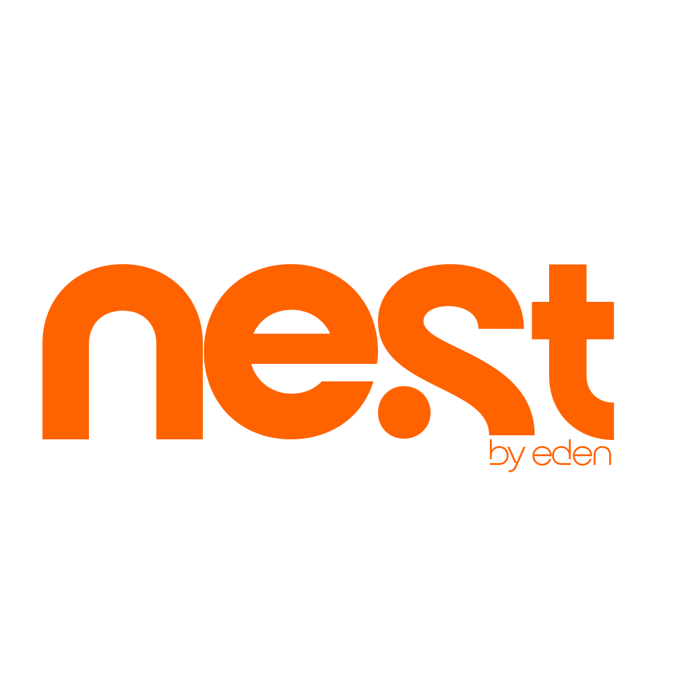

# Nest — Asset & Equipment Management

<p align="center">
  
</p>

<p align="center">
  <a href="https://nextjs.org/"></a>
  <a href="https://www.typescriptlang.org/"></a>
  <a href="https://supabase.com/"></a>
  <a href="https://vercel.com/"></a>
</p>

A production‑ready Next.js 15 application for managing gear inventory, requests, check‑ins, notifications, reports and real‑time updates, powered by Supabase.

---

## Visuals

> Tip: See GitHub’s basic formatting for images, lists and diagrams: [Basic writing and formatting syntax](https://docs.github.com/en/get-started/writing-on-github/getting-started-with-writing-and-formatting-on-github/basic-writing-and-formatting-syntax).

### Screenshots

<p>
  
</p>

<!--
Add your own screenshots under docs/images/ and replace the examples below.
For example:
- docs/images/admin-dashboard.png
- docs/images/user-dashboard.png
- docs/images/manage-gears.png
-->

| Admin Dashboard | User Dashboard | Manage Gears |
|---|---|---|
|  |  |  |

### Architecture (Mermaid)

```mermaid
flowchart TD
  A[Client (Next.js App Router)] -->|fetch| B[/API Routes/]
  B -->|Supabase server client| C[(Postgres / Supabase)]
  A -->|Realtime| C
  B --> D[Google Chat Webhook]
  B --> E[Email Provider]

  subgraph App
    A
    B
  end

  subgraph Supabase
    C
  end
```

---

## Overview

Nest provides:

- Unified admin and user dashboards
- Inventory (gears) management with images
- Request, approval, and check‑in workflows
- Real‑time notifications and analytics
- Secure RLS policies on Supabase
- CSV import/export and PDF/Charts

This document explains how to develop, configure, deploy, and operate Nest in production.

---

## Tech Stack

- Framework: **Next.js 15** (App Router)
- Language: **TypeScript**
- UI: **shadcn/ui**, **Tailwind CSS**
- Database + Auth + Realtime + Storage: **Supabase** (PostgreSQL)
- Charts & PDF: **Recharts**, **jspdf / autotable**
- Validation: **Zod**
- State/Forms: **react‑hook‑form**

---

## Architecture

- `src/app`: App Router pages and API routes
- `src/components`: UI components (admin, user, shared)
- `src/hooks`: Data hooks and domain logic
- `src/lib`: Supabase clients, utilities, email, analytics, API client
- `src/services`: Reports/notifications service wrappers
- `supabase/`: Migrations, functions, policies

Important services:

- `src/lib/supabase/client.ts`: browser client
- `src/lib/supabase/server.ts`: server‑side client with cookies
- `src/app/api/*`: serverless endpoints (fetch profile, analytics, notifications, reports)

---

## Production Features

- RLS enforced: only Admin/SuperAdmin can mutate inventory; users read their own data
- Safe defaults:
  - `gears.initial_condition` default `'Good'`
  - `gears.status` default `'Available'`
  - Quantity and available_quantity default to `1`
- Notifications: DB + optional Google Chat webhook
- Hardened error handling and non‑blocking external calls
- Lightweight non‑PII analytics: auth events only (email domain, method)

---

## Prerequisites

- Node.js 18+
- PNPM/NPM (repo uses npm scripts)
- Supabase project with:
  - URL: `NEXT_PUBLIC_SUPABASE_URL`
  - ANON KEY: `NEXT_PUBLIC_SUPABASE_ANON_KEY`
  - SERVICE-ROLE KEY (server API/admin tasks): `SUPABASE_SERVICE_ROLE_KEY`
- (Optional) Google Chat webhook for admin signals

---

## Environment Variables

Create `.env.local`:

```bash
NEXT_PUBLIC_SUPABASE_URL=...
NEXT_PUBLIC_SUPABASE_ANON_KEY=...
SUPABASE_SERVICE_ROLE_KEY=...
# Optional webhooks (dev/prod)
GOOGLE_CHAT_WEBHOOK_URL=...
GOOGLE_CHAT_WEBHOOK_URL_DEV=...
# Optional email
RESEND_API_KEY=...
```

Never commit secrets. Use Vercel/Cloud provider secrets for production.

---

## Setup

```bash
npm install
# (optional) clean cache
rm -rf .next
```

Run local dev:

```bash
npm run dev
```

---

## Database & Security (Supabase)

Apply migrations in `supabase/migrations` to provision tables, policies, and functions.

Key RLS policies (summarized):

- `public.gears`:
  - SELECT: authenticated
  - INSERT/UPDATE/DELETE: Admin or SuperAdmin
- `public.gear_states`:
  - SELECT: authenticated
  - INSERT/UPDATE: Admin or SuperAdmin
- Requests/Check‑ins/Notifications: policies scope by owner/role

Defaults:

- `gears.initial_condition = 'Good'`
- `gears.status = 'Available'`

Confirm with:

```sql
select policyname, cmd from pg_policies where schemaname='public' and tablename in ('gears','gear_states');
```

---

## Development

- Lint & typecheck during CI/CD
- Modular components (admin/user)
- Shared `AuthCard` and `PasswordField` for consistent auth UI
- Phone input formatting helpers
- Submit cooldown & disabled buttons to avoid double-submits

Helpful scripts:

```bash
npm run dev       # start dev server
npm run build     # production build
npm run start     # run production build locally
```

---

## Building for Production

```bash
npm run build
```

Next.js optimizes and outputs `.next` static assets.

Production rules:

- Ensure `.env`/secrets are set on the platform
- Verify Supabase RLS and service-role key for server API routes
- Optional: set `GOOGLE_CHAT_WEBHOOK_URL` for admin notifications

---

## Deployment

### Vercel (recommended)

1. Import Git repository
2. Add environment variables in Vercel Project Settings
3. Set Node.js version to 18+
4. Deploy; Vercel will run `npm run build` automatically

### Self‑hosting

- Build: `npm run build`
- Start: `npm run start`
- Use a reverse proxy (NGINX/Caddy) with HTTPS
- Point environment variables to your Supabase project

---

## API Routes (selected)

- `GET /api/users/profile` — returns current user profile `{ data, error }`
- `POST /api/notifications/google-chat` — send Google Chat notifications
- `GET /api/admin/analytics` — admin analytics bundle
- `GET /api/gears` — browse & filter (status/category/query)

API client helpers use `credentials: 'include'` and raise on non‑OK responses (`src/lib/apiClient.ts`).

---

## Monitoring & Logs

- Browser console: errors surfaced with structured messages
- Server logs: function/API route logs print context for failures (e.g., Google Chat)
- Supabase: use SQL console for schema/policy verification and `pg_policies` checks

---

## Security & Privacy

- RLS enforces least privilege at the database layer
- Service‑Role key used only on server
- Non‑PII analytics: we log only event, method, timestamp, and email domain
- Optional webhook secrets stored only in env

---

## Troubleshooting

- 401 on `/api/users/profile`: ensure cookies/session exist and route is deployed
- 403 on inventory insert: verify Admin/SuperAdmin role and `gear_states` INSERT policy
- Images not visible: check `gear_images` bucket policies and public URL retrieval
- Empty `{}` error toasts: now replaced with descriptive messages; check console for details

---

## Contributing

- Use meaningful PRs and follow repository linting rules
- Keep UI components small and reusable; avoid monolith files
- Prefer type‑safe API responses and early returns

---

## License

Copyright © Daniel Samuel. All rights reserved.
